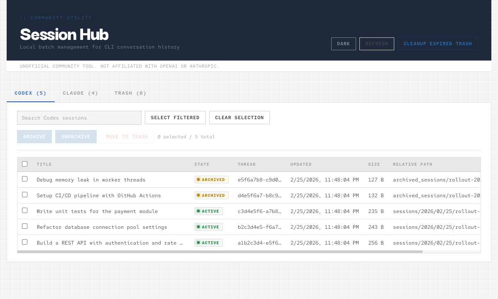
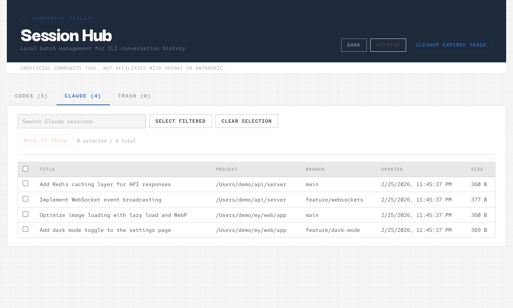
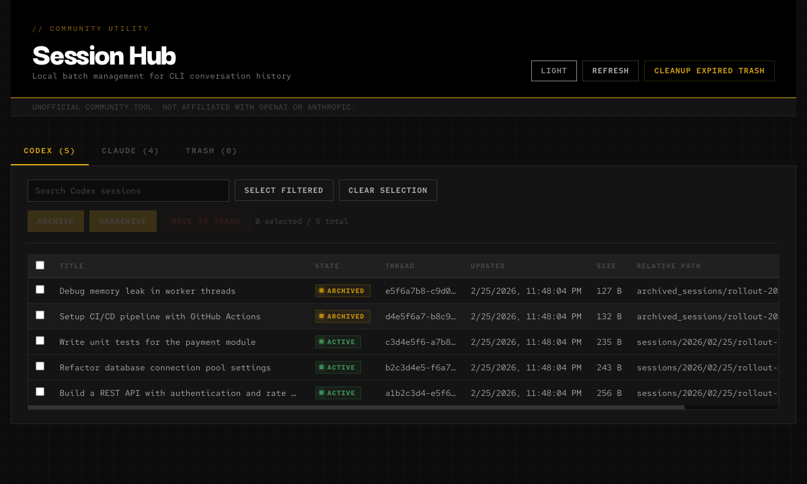

# Session Hub

A local web tool for batch-managing CLI conversation history from **Codex** and **Claude Code**.

> Two install paths are supported:
> 1) one-line shell installer (`curl`) for users without Homebrew
> 2) Homebrew formula (optional)

## Screenshots

**Codex tab — light theme**



**Claude tab — light theme**



**Codex tab — dark theme**



## Install (No Homebrew Required)

Before using the shell installer, verify Node is available:

```bash
node -v
```

Then install:

```bash
curl -fsSL https://raw.githubusercontent.com/cola-runner/session-hub/main/scripts/install.sh | bash
```

Then start:

```bash
session-hub start
```

## Install with Homebrew (Optional)

```bash
brew install cola-runner/tap/session-hub
```

Then start:

```bash
session-hub start
```

## Features

- **Multi-provider support** — manage sessions from both Codex and Claude Code
- **Separate tabs** — Codex and Claude sessions are organized in dedicated tabs
- browse active and archived Codex sessions
- batch archive and unarchive Codex sessions
- browse Claude Code sessions with project and branch info
- soft-delete sessions to trash (both Codex and Claude)
- restore or permanently purge trash items
- auto-clean expired trash on startup
- hide system-generated sessions automatically
- **Light / Dark theme** — toggle between themes; preference is saved locally

This is a community utility and is not affiliated with OpenAI or Anthropic.

## Quick Start

### 1) Install (recommended)

```bash
node -v
curl -fsSL https://raw.githubusercontent.com/cola-runner/session-hub/main/scripts/install.sh | bash
```

### 2) Start the app

```bash
session-hub start
```

This starts a local server and opens the web UI.

### 3) Manage sessions

Use the tabs in the UI:
- **Codex**: archive, unarchive, or move sessions to trash
- **Claude**: view sessions by project/branch, move to trash
- **Trash**: restore or permanently delete (items from both providers)

## Requirements

- Shell installer path: Node.js 18+, `curl`, `tar`
- Homebrew path: Homebrew (Node is installed as a formula dependency)

## Default Paths

| Item | Default |
| --- | --- |
| Codex home | `~/.codex` |
| Claude home | `~/.claude` |
| Active Codex sessions | `~/.codex/sessions` |
| Archived Codex sessions | `~/.codex/archived_sessions` |
| Claude sessions | `~/.claude/projects/` |
| Trash root | `~/.codex-trash` |
| Local install dir | `~/.session-hub` |
| Launcher path | `~/.local/bin/session-hub` |

## CLI Usage

```bash
session-hub start [--codex-home PATH] [--claude-home PATH] [--trash-root PATH] [--retention-days N] [--port N] [--no-open]
session-hub cleanup [--codex-home PATH] [--trash-root PATH] [--retention-days N]
session-hub install [--bin-dir PATH]
session-hub uninstall [--bin-dir PATH]
```

### `start` flags

| Flag | Description | Default |
| --- | --- | --- |
| `--codex-home` | Codex data directory | `~/.codex` |
| `--claude-home` | Claude Code data directory | `~/.claude` |
| `--trash-root` | Soft-delete storage root | `~/.codex-trash` |
| `--retention-days` | Trash retention window | `30` |
| `--port` | HTTP port (`0` = random free port) | `0` |
| `--no-open` | Do not auto-open browser | `false` |

Example:

```bash
session-hub start \
  --codex-home ~/.codex \
  --claude-home ~/.claude \
  --trash-root ~/.codex-trash \
  --retention-days 30 \
  --port 3789 \
  --no-open
```

### Run cleanup only

```bash
session-hub cleanup --retention-days 30
```

## Install Options

### A) One-line installer (recommended, no Homebrew needed)

Before using the installer, verify Node is available:

```bash
node -v
curl -fsSL https://raw.githubusercontent.com/cola-runner/session-hub/main/scripts/install.sh | bash
```

Optional install variables:

```bash
SESSION_HUB_REPO=<owner/repo> \
SESSION_HUB_REF=main \
SESSION_HUB_BIN_DIR="$HOME/.local/bin" \
SESSION_HUB_INSTALL_ROOT="$HOME/.session-hub" \
bash scripts/install.sh
```

Note: installer refuses unsafe install roots like `/` and `$HOME`.

### B) Homebrew (optional)

```bash
brew install cola-runner/tap/session-hub
```

### C) Install from local source

```bash
node src/cli.js install
```

### D) Homebrew Formula Template

Use `packaging/homebrew/session-hub.rb` as the formula template when publishing a tap.

## Uninstall

One-line:

```bash
curl -fsSL https://raw.githubusercontent.com/cola-runner/session-hub/main/scripts/uninstall.sh | bash
```

Local:

```bash
node src/cli.js uninstall
```

## Safety

- binds to `127.0.0.1` only (local machine)
- no remote upload of session contents
- delete is soft by default (trash-first)
- permanent delete requires explicit action

## Development

```bash
npm test
```
