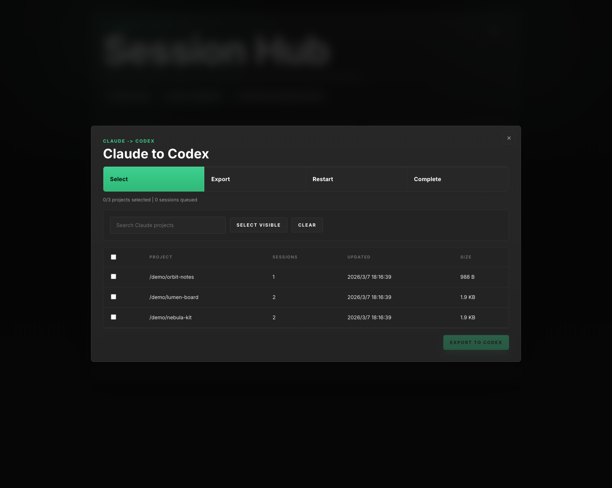
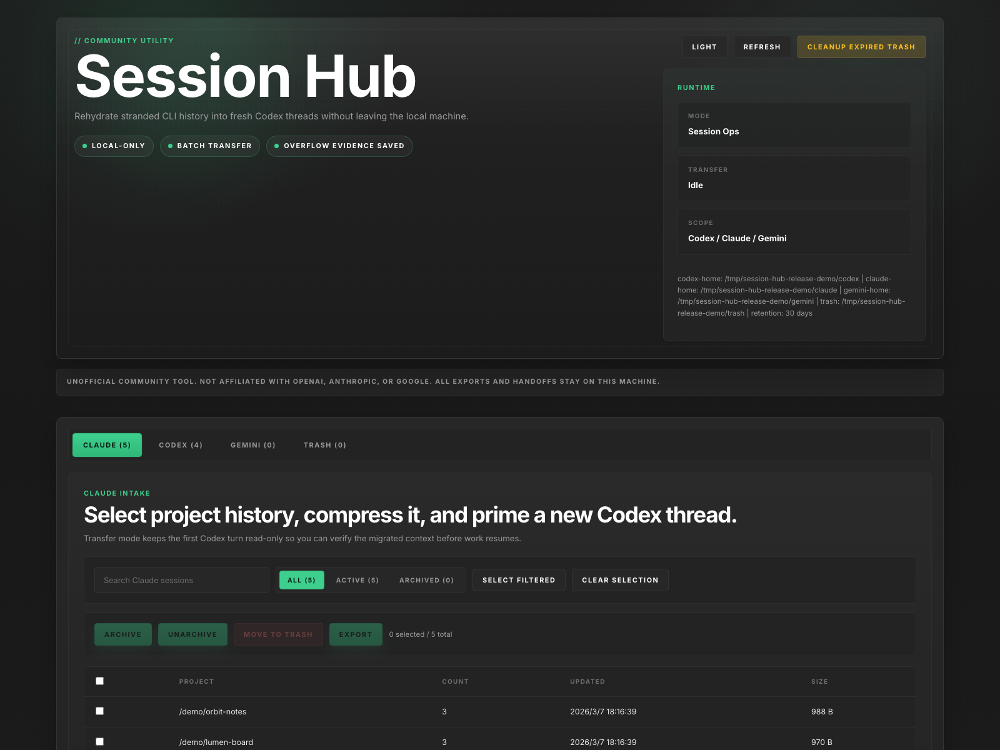

# Session Hub

A local web tool for batch-managing CLI conversation history from **Codex** and **Claude Code**.

> Two install paths are supported:
> 1) one-line shell installer (`curl`) for users without Homebrew
> 2) Homebrew formula (optional)

## Screenshots

All screenshots below use **synthetic local demo data** and reflect the **current release UI**. No real Codex / Claude history is included.

**Transfer popup — dark theme**



**Dashboard / session ops — dark theme**



## Install (No Homebrew Required)

Before using the shell installer, verify Node is available:

```bash
node -v
```

Then install:

```bash
curl -fsSL https://raw.githubusercontent.com/cola-runner/session-hub/main/scripts/install.sh | bash
```

The installer now launches Session Hub automatically in the background and opens the browser directly into the Claude -> Codex transfer popup.

## Install with Homebrew (Optional)

```bash
brew install cola-runner/tap/session-hub
```

Then start:

```bash
session-hub start
```

## Features

- **Multi-provider support** — manage sessions from both Codex and Claude Code
- **Separate tabs** — Codex and Claude sessions are organized in dedicated tabs
- browse active and archived Codex sessions
- batch archive and unarchive Codex sessions
- browse Claude Code sessions with project and branch info
- export selected Claude sessions into a Codex continuation package
- soft-delete sessions to trash (both Codex and Claude)
- restore or permanently purge trash items
- auto-clean expired trash on startup
- hide system-generated sessions automatically
- **Light / Dark theme** — toggle between themes; preference is saved locally

This is a community utility and is not affiliated with OpenAI or Anthropic.

## Quick Start

### 1) Install (recommended)

```bash
node -v
curl -fsSL https://raw.githubusercontent.com/cola-runner/session-hub/main/scripts/install.sh | bash
```

### 2) Start the app

```bash
session-hub start
```

This starts a local server and opens the web UI in the **Claude -> Codex transfer popup**.

### 3) Manage sessions

Use the tabs in the UI:
- **Codex**: archive, unarchive, or move sessions to trash
- **Claude**: view sessions by project/branch, archive/unarchive/delete, export selected sessions
- **Trash**: restore or permanently delete (items from both providers)

### 4) Transfer Claude sessions to Codex (recommended)

In transfer mode:
1. Session Hub opens a single popup with **active Claude sessions grouped by project**.
2. Select the projects to migrate.
3. Click **Export To Codex**. There is no extra confirmation step.
4. Session Hub exports locally and creates **one new Codex session per selected Claude project**.
5. The popup detects the Codex app state and asks you to **restart Codex manually once**.
6. After Codex is reopened, the popup marks the transfer as complete.

### 5) Manual export (optional)

In the **Claude** tab:
1. Select one or more Claude sessions.
2. Click **Export**.
3. Confirm the ownership checkbox.
4. Copy the generated import prompt and paste it into a new Codex session.

The export is local-only and generates:
- `codex-import-prompt.md`
- `context-pack.json`
- `raw-events.jsonl`
- `manifest.json`
- `overflow-evidence.md`

## Requirements

- Shell installer path: Node.js 18+, `curl`, `tar`
- Homebrew path: Homebrew (Node is installed as a formula dependency)

## Default Paths

| Item | Default |
| --- | --- |
| Codex home | `~/.codex` |
| Claude home | `~/.claude` |
| Active Codex sessions | `~/.codex/sessions` |
| Archived Codex sessions | `~/.codex/archived_sessions` |
| Claude sessions | `~/.claude/projects/` |
| Trash root | `~/.codex-trash` |
| Local install dir | `~/.session-hub` |
| Launcher path | `~/.local/bin/session-hub` |
| Export root | `~/.session-hub/exports` |

## CLI Usage

```bash
session-hub start [--codex-home PATH] [--claude-home PATH] [--trash-root PATH] [--retention-days N] [--port N] [--no-open]
session-hub cleanup [--codex-home PATH] [--trash-root PATH] [--retention-days N]
session-hub install [--bin-dir PATH]
session-hub uninstall [--bin-dir PATH]
```

### `start` flags

| Flag | Description | Default |
| --- | --- | --- |
| `--codex-home` | Codex data directory | `~/.codex` |
| `--claude-home` | Claude Code data directory | `~/.claude` |
| `--trash-root` | Soft-delete storage root | `~/.codex-trash` |
| `--retention-days` | Trash retention window | `30` |
| `--port` | HTTP port (`0` = random free port) | `0` |
| `--no-open` | Do not auto-open browser | `false` |

Example:

```bash
session-hub start \
  --codex-home ~/.codex \
  --claude-home ~/.claude \
  --trash-root ~/.codex-trash \
  --retention-days 30 \
  --port 3789 \
  --no-open
```

### Run cleanup only

```bash
session-hub cleanup --retention-days 30
```

## Install Options

### A) One-line installer (recommended, no Homebrew needed)

Before using the installer, verify Node is available:

```bash
node -v
curl -fsSL https://raw.githubusercontent.com/cola-runner/session-hub/main/scripts/install.sh | bash
```

To install without launching the popup immediately:

```bash
curl -fsSL https://raw.githubusercontent.com/cola-runner/session-hub/main/scripts/install.sh | SESSION_HUB_AUTO_START=0 bash
```

Optional install variables:

```bash
SESSION_HUB_REPO=<owner/repo> \
SESSION_HUB_REF=main \
SESSION_HUB_BIN_DIR="$HOME/.local/bin" \
SESSION_HUB_INSTALL_ROOT="$HOME/.session-hub" \
bash scripts/install.sh
```

Note: installer refuses unsafe install roots like `/` and `$HOME`.

### B) Homebrew (optional)

```bash
brew install cola-runner/tap/session-hub
```

### C) Install from local source

```bash
node src/cli.js install
```

### D) Homebrew Formula Template

Use `packaging/homebrew/session-hub.rb` as the formula template when publishing a tap.

## Release / Packaging

Session Hub is shipped as a **source release**. There is no frontend build step; the release artifact used by the shell installer and Homebrew is the GitHub tag tarball.

### Release checklist

1. Update version and release notes.

```bash
# example
sed -n '1,80p' package.json
```

2. Refresh screenshots using **synthetic demo data only**.

Do not capture screenshots from a real `~/.codex` / `~/.claude` workspace.

3. Run release checks.

```bash
npm test
node --check web/app.js
bash -n scripts/install.sh
git diff --check
```

4. Commit, tag, and push the release.

```bash
git tag v0.2.2
git push origin main
git push origin v0.2.2
```

5. Download the GitHub source tarball for the tag and compute its sha256.

```bash
curl -L -o /tmp/session-hub-v0.2.2.tar.gz \
  https://github.com/cola-runner/session-hub/archive/refs/tags/v0.2.2.tar.gz

shasum -a 256 /tmp/session-hub-v0.2.2.tar.gz
```

6. Regenerate the Homebrew formula file from the sha.

```bash
./scripts/write-homebrew-formula.sh v0.2.2 <sha256> cola-runner/session-hub
```

7. Copy the updated formula into the Homebrew tap repo and publish that change.

The generated formula file is:

```bash
packaging/homebrew/session-hub.rb
```

### Pinned installer for a release tag

The shell installer defaults to `main`, but you can pin it to a released tag tarball:

```bash
curl -fsSL https://raw.githubusercontent.com/cola-runner/session-hub/main/scripts/install.sh | \
  SESSION_HUB_TARBALL_URL=https://github.com/cola-runner/session-hub/archive/refs/tags/v0.2.2.tar.gz \
  bash
```

## Uninstall

One-line:

```bash
curl -fsSL https://raw.githubusercontent.com/cola-runner/session-hub/main/scripts/uninstall.sh | bash
```

## License

[MIT](./LICENSE)

Local:

```bash
node src/cli.js uninstall
```

## Safety

- binds to `127.0.0.1` only (local machine)
- no remote upload of session contents
- delete is soft by default (trash-first)
- permanent delete requires explicit action

## Development

```bash
npm test
```
